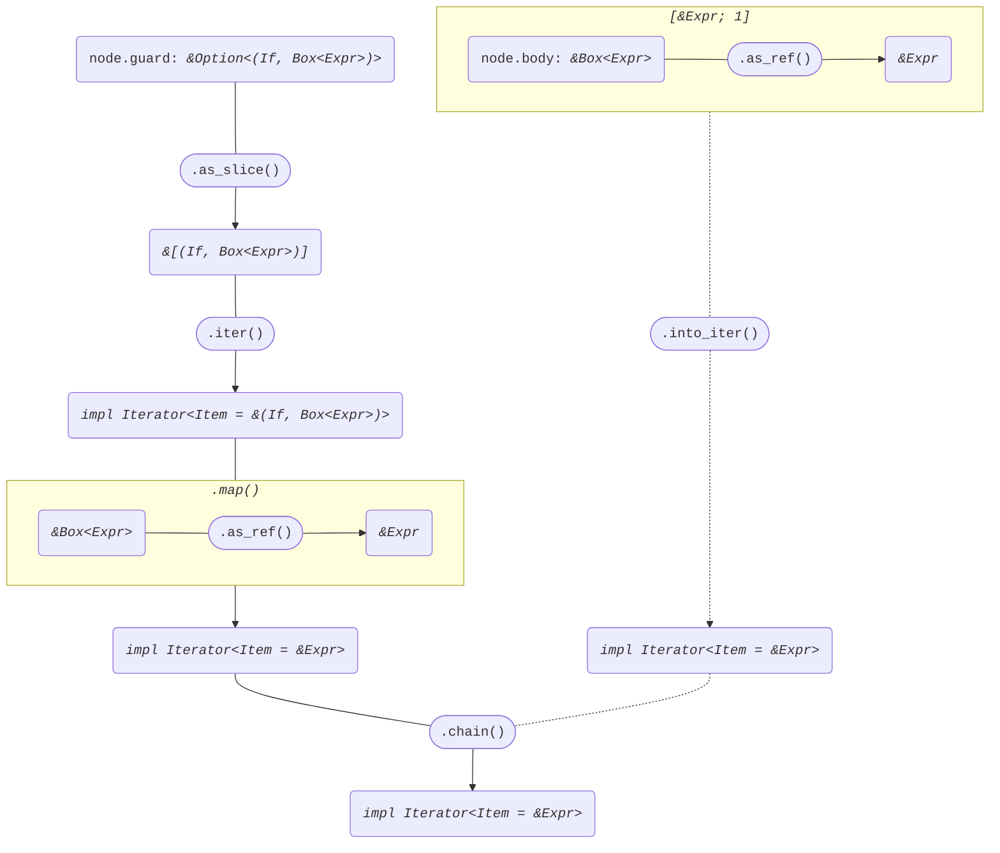
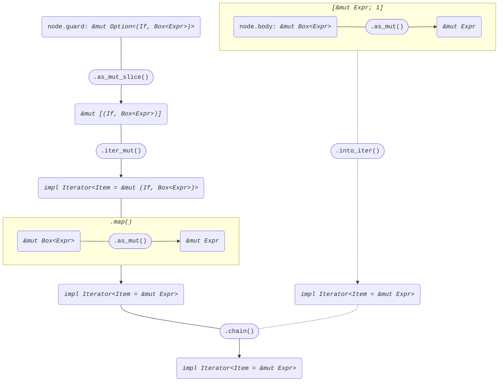

+++
title = "Struct Arm"
+++

[docs.rs](https://docs.rs/syn/latest/syn/struct.Arm.html)

```rust
pub struct Arm {
    pub attrs: Vec<Attribute>,
    pub pat: Pat,
    pub guard: Option<(If, Box<Expr>)>,
    pub fat_arrow_token: FatArrow,
    pub body: Box<Expr>,
    pub comma: Option<Comma>,
}
```

## Iterator<Item = &Expr>

node: *&Arm*

```rust
node.guard
    .as_slice()
    .iter()
    .map(|(_, expr)| expr.as_ref())
    .chain([node.body.as_ref()])
```



## Iterator<Item = &mut Expr>

node: *&mut Arm*

```rust
node.guard
    .as_mut_slice()
    .iter_mut()
    .map(|(_, expr)| expr.as_mut())
    .chain([node.body.as_mut()])
```


