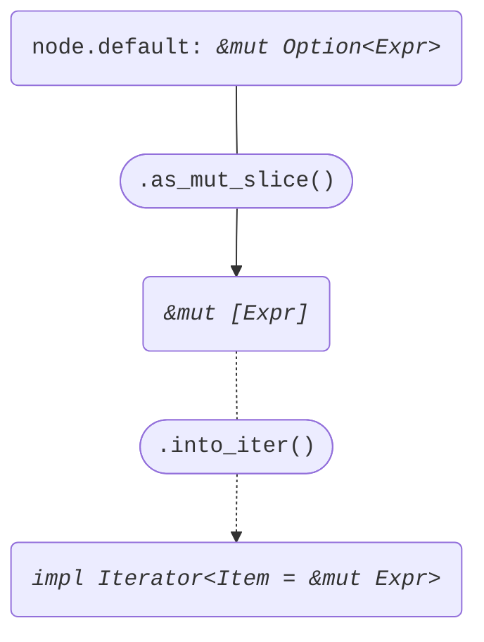

+++
title = "Struct ConstParam"
+++

[docs.rs](https://docs.rs/syn/latest/syn/struct.ConstParam.html)

```rust
pub struct ConstParam {
    pub attrs: Vec<Attribute>,
    pub const_token: Const,
    pub ident: Ident,
    pub colon_token: Colon,
    pub ty: Type,
    pub eq_token: Option<Eq>,
    pub default: Option<Expr>,
}
```

## Iterator<Item = &Expr>

node: *&ConstParam*

```rust
node.default.as_slice()
```


## Iterator<Item = &mut Expr>

node: *&mut ConstParam*

```rust
node.default.as_mut_slice()
```


