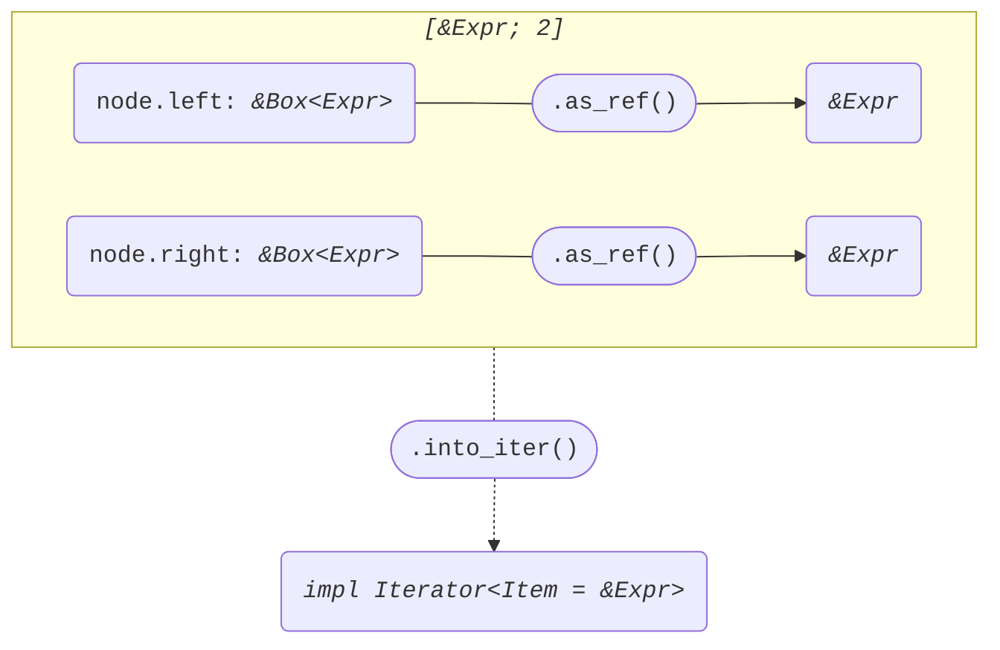

+++
title = "Struct ExprBinary"
+++

[docs.rs](https://docs.rs/syn/latest/syn/struct.ExprBinary.html)

```rust
pub struct ExprBinary {
    pub attrs: Vec<Attribute>,
    pub left: Box<Expr>,
    pub op: BinOp,
    pub right: Box<Expr>,
}
```

## Iterator<Item = &Expr>

node: *&ExprBinary*

```rust
[node.left.as_ref(), node.right.as_ref()]
```



## Iterator<Item = &mut Expr>

node: *&mut ExprBinary*

```rust
[node.left.as_mut(), node.right.as_mut()]
```


