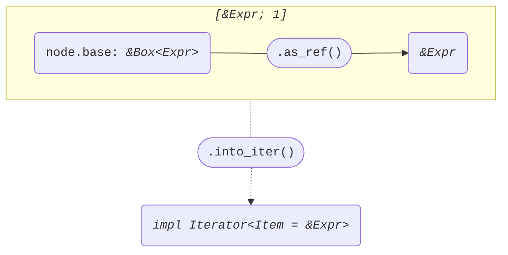
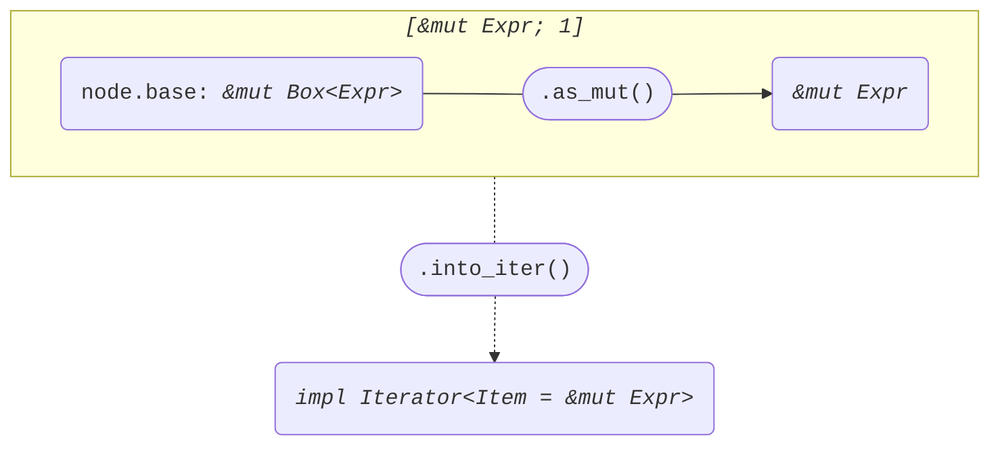

+++
title = "Struct ExprField"
+++

[docs.rs](https://docs.rs/syn/latest/syn/struct.ExprField.html)

```rust
pub struct ExprField {
    pub attrs: Vec<Attribute>,
    pub base: Box<Expr>,
    pub dot_token: Dot,
    pub member: Member,
}
```

## Iterator<Item = &Expr>

node: *&ExprField*

```rust
[node.base.as_ref()]
```



## Iterator<Item = &mut Expr>

node: *&mut ExprField*

```rust
[node.base.as_mut()]
```


