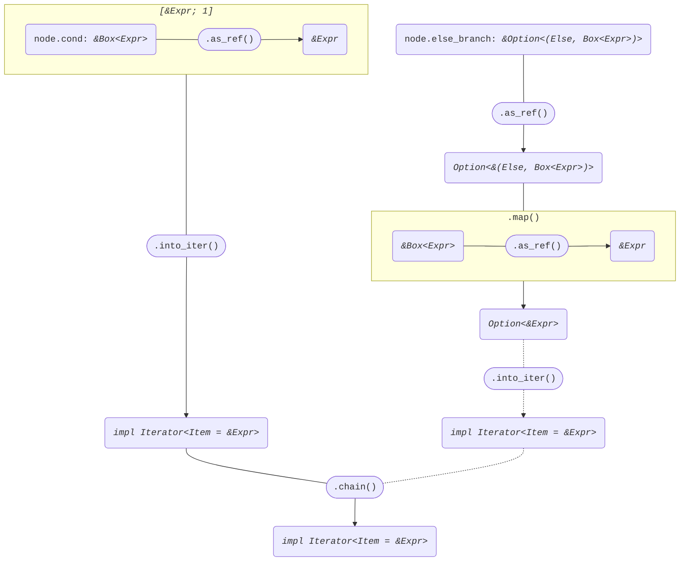
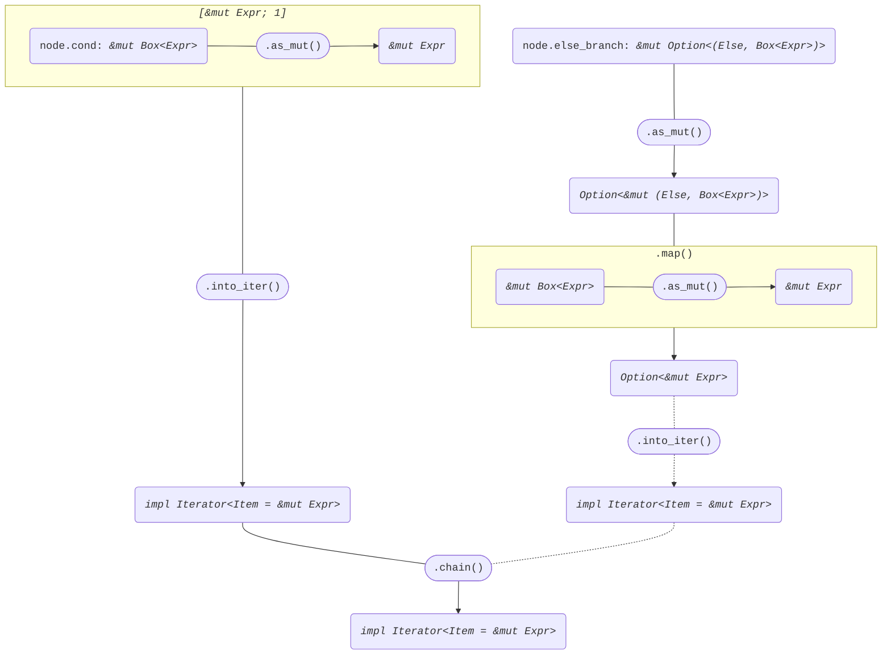

+++
title = "Struct ExprIf"
+++

[docs.rs](https://docs.rs/syn/latest/syn/struct.ExprIf.html)

```rust
pub struct ExprIf {
    pub attrs: Vec<Attribute>,
    pub if_token: If,
    pub cond: Box<Expr>,
    pub then_branch: Block,
    pub else_branch: Option<(Else, Box<Expr>)>,
}
```

## Iterator<Item = &Expr>

node: *&ExprIf*

```rust
[node.cond.as_ref()]
    .into_iter()
    .chain(
        node.else_branch
            .as_ref()
            .map(|(_, expr)| expr.as_ref()),
    )
```



## Iterator<Item = &mut Expr>

node: *&mut ExprIf*

```rust
[node.cond.as_mut()]
    .into_iter()
    .chain(
        node.else_branch
            .as_mut()
            .map(|(_, expr)| expr.as_mut()),
    )
```


