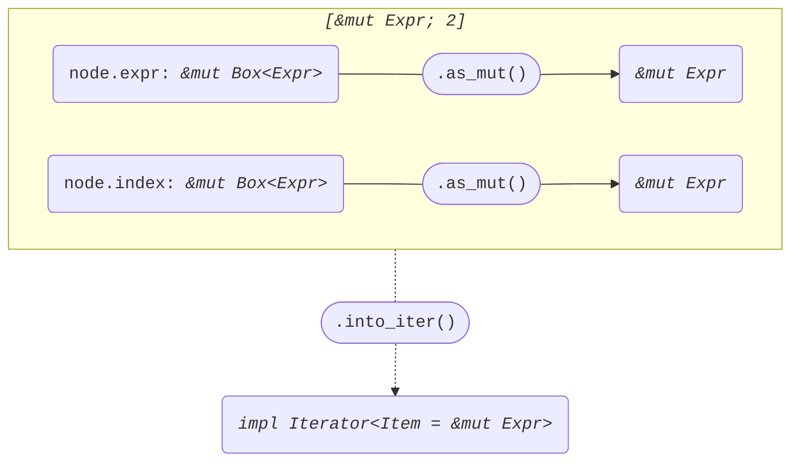

+++
title = "Struct ExprIndex"
+++

[docs.rs](https://docs.rs/syn/latest/syn/struct.ExprIndex.html)

```rust
pub struct ExprIndex {
    pub attrs: Vec<Attribute>,
    pub expr: Box<Expr>,
    pub bracket_token: Bracket,
    pub index: Box<Expr>,
}
```

## Iterator<Item = &Expr>

node: *&ExprIndex*

```rust
[node.expr.as_ref(), node.index.as_ref()]
```


## Iterator<Item = &mut Expr>

node: *&mut ExprIndex*

```rust
[node.expr.as_mut(), node.index.as_mut()]
```


