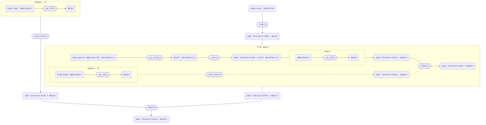

```mermaid
flowchart TD
    subgraph 1["<code>.flat_map()</code>"]
        101("<code>node.guard:#nbsp;<em>&mut#nbsp;Option#lt;(If,#nbsp;Box#lt;Expr#gt;)#gt;</em></code>") --- 102
        102(["<code>.as_mut_slice()</code>"]) --> 103
        103("<code><em>&mut#nbsp;[(If,#nbsp;Box#lt;Expr#gt;)]</em></code>") --- 104
        104(["<code>.iter_mut()</code>"]) --> 105
        105("<code><em>impl#nbsp;Iterator#lt;Item#nbsp;=#nbsp;&mut#nbsp;(If,#nbsp;Box#lt;Expr#gt;)#gt;</em></code>") --- 2
        subgraph 2["<code><em>.map()</em></code>"]
            direction LR
            201("<code><em>&mut#nbsp;Box#lt;Expr#gt;</em></code>") --- 202
            202(["<code>.as_mut()</code>"]) --> 203
            203("<code><em>&mut#nbsp;Expr</em></code>")
        end
        2 --> 106
        106("<code><em>impl#nbsp;Iterator#lt;Item#nbsp;=#nbsp;&mut#nbsp;Expr#gt;</em></code>") --- 107
        107(["<code>.chain()</code>"]) --> 108
        108("<code><em>impl#nbsp;Iterator#lt;Item#nbsp;=#nbsp;&mut#nbsp;Expr#gt;</em></code>")
        subgraph 3["<code><em>[&mut#nbsp;Expr;#nbsp;1]</em></code>"]
            direction LR
            301("<code>node.body:#nbsp;<em>&mut#nbsp;Box#lt;Expr#gt;</em></code>") --- 302
            302(["<code>.as_mut()</code>"]) --> 303
            303("<code><em>&mut#nbsp;Expr</em></code>")
        end
        3 -...- 109
        109(["<code>.into_iter()</code>"]) -...-> 110
        110("<code><em>impl#nbsp;Iterator#lt;Item#nbsp;=#nbsp;&mut#nbsp;Expr#gt;</em></code>") -.- 107
    end
    subgraph 4["<code><em>[&mut#nbsp;Expr;#nbsp;1]</em></code>"]
        direction LR
        401("<code>node.expr:#nbsp;<em>&mut#nbsp;Box#lt;Expr#gt;</em></code>") --- 402
        402(["<code>.as_mut()</code>"]) --> 403
        403("<code><em>&mut#nbsp;Expr</em></code>")
    end
    4 ---- 501
    501(["<code>.into_iter()</code>"]) ---> 502
    502("<code><em>impl#nbsp;Iterator#lt;Item#nbsp;=#nbsp;&mut#nbsp;Expr#gt;</em></code>") --- 503
    503(["<code>.chain()</code>"]) --> 504
    504("<code><em>impl#nbsp;Iterator#lt;Item#nbsp;=#nbsp;&mut#nbsp;Expr#gt;</em></code>")
    505("<code>node.arms:#nbsp;<em>&mut#nbsp;Vec#lt;Arm#gt;</em></code>") --- 506
    506(["<code>.iter()</code>"]) --> 507
    507("<code><em>impl#nbsp;Iterator#lt;Item#nbsp;=#nbsp;&mut#nbsp;Arm#gt;</em></code>") --- 1
    1 --- 508
    508("<code><em>impl#nbsp;Iterator#lt;Item#nbsp;=#nbsp;&mut#nbsp;Expr#gt;</em></code>") --- 503
```

+++
title = "Struct ExprMatch"
+++

[docs.rs](https://docs.rs/syn/latest/syn/struct.ExprMatch.html)

```rust
pub struct ExprMatch {
    pub attrs: Vec<Attribute>,
    pub match_token: Match,
    pub expr: Box<Expr>,
    pub brace_token: Brace,
    pub arms: Vec<Arm>,
}

pub struct Arm {
    pub attrs: Vec<Attribute>,
    pub pat: Pat,
    pub guard: Option<(If, Box<Expr>)>,
    pub fat_arrow_token: FatArrow,
    pub body: Box<Expr>,
    pub comma: Option<Comma>,
}
```

## Iterator<Item = &Expr>

node: *&ExprMatch*

```rust
[node.expr.as_ref()]
    .into_iter()
    .chain(
        node.arms
            .iter()
            .flat_map(|arm| {
                arm.guard
                    .as_slice()
                    .iter()
                    .map(|(_, expr)| expr.as_ref())
                    .chain([arm.body.as_ref()])
            }),
    )
```



## Iterator<Item = &mut Expr>

node: *&mut ExprMatch*

```rust
[node.expr.as_mut()]
    .into_iter()
    .chain(
        node.arms
            .iter_mut()
            .flat_map(|arm| {
                arm.guard
                    .as_mut_slice()
                    .iter_mut()
                    .map(|(_, expr)| expr.as_mut())
                    .chain([arm.body.as_mut()])
            }),
    )
```


