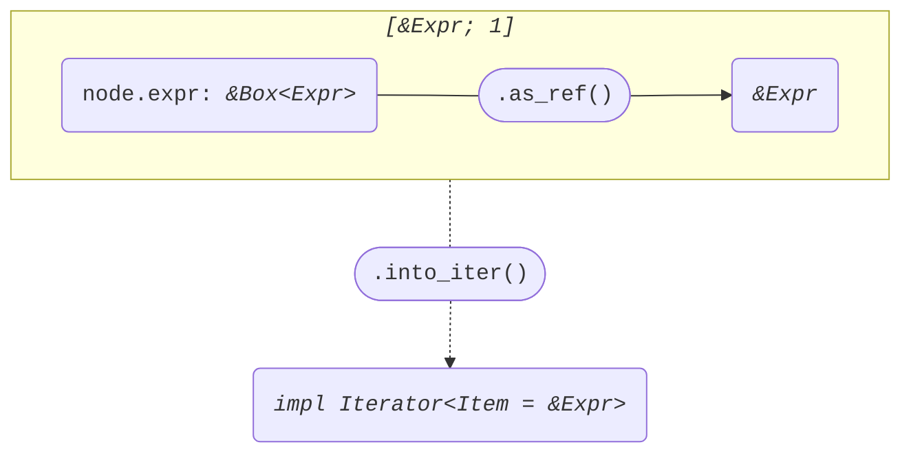
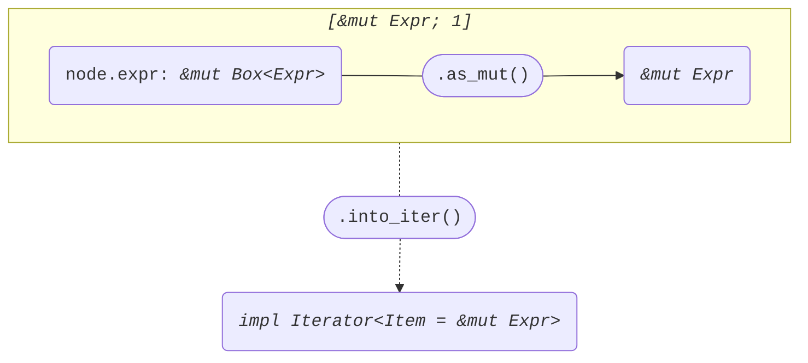

+++
title = "Struct ExprReference"
+++

[docs.rs](https://docs.rs/syn/latest/syn/struct.ExprReference.html)

```rust
pub struct ExprReference {
    pub attrs: Vec<Attribute>,
    pub and_token: And,
    pub mutability: Option<Mut>,
    pub expr: Box<Expr>,
}
```

## Iterator<Item = &Expr>

node: *&ExprReference*

```rust
[node.expr.as_ref()]
```



## Iterator<Item = &mut Expr>

node: *&mut ExprReference*

```rust
[node.expr.as_mut()]
```


