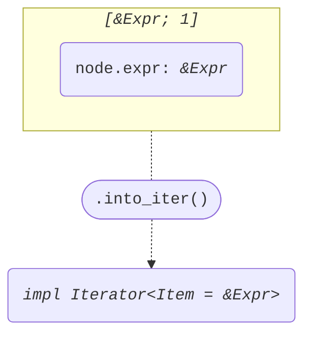
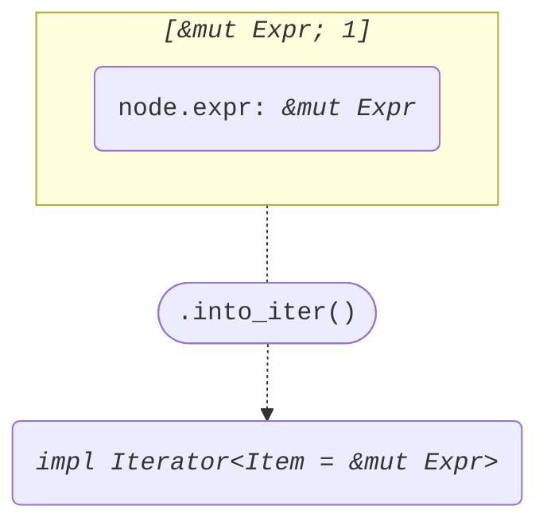

+++
title = "Struct FieldValue"
+++

[docs.rs](https://docs.rs/syn/latest/syn/struct.FieldValue.html)

```rust
pub struct FieldValue {
    pub attrs: Vec<Attribute>,
    pub member: Member,
    pub colon_token: Option<Colon>,
    pub expr: Expr,
}
```

## Iterator<Item = &Expr>

node: *&FieldValue*

```rust
[&node.expr]
```



## Iterator<Item = &mut Expr>

node: *&mut FieldValue*

```rust
[&mut node.expr]
```


