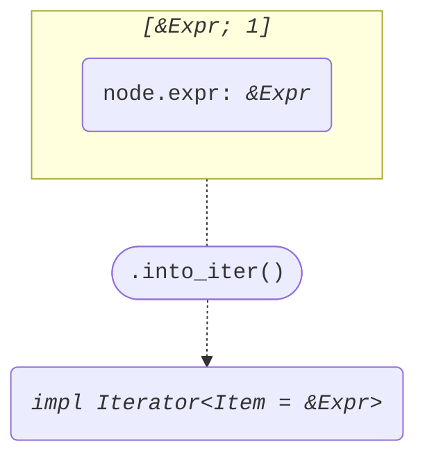
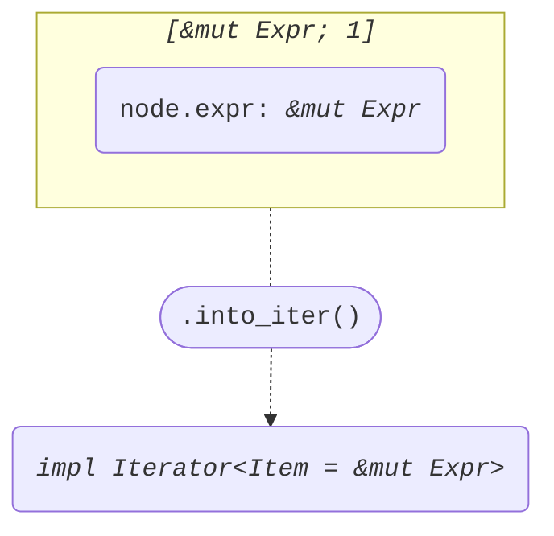

+++
title = "Struct ImplItemConst"
+++

[docs.rs](https://docs.rs/syn/latest/syn/struct.ImplItemConst.html)

```rust
pub struct ImplItemConst {
    pub attrs: Vec<Attribute>,
    pub vis: Visibility,
    pub defaultness: Option<Default>,
    pub const_token: Const,
    pub ident: Ident,
    pub generics: Generics,
    pub colon_token: Colon,
    pub ty: Type,
    pub eq_token: Eq,
    pub expr: Expr,
    pub semi_token: Semi,
}
```

## Iterator<Item = &Expr>

node: *&ImplItemConst*

```rust
[&node.expr]
```



## Iterator<Item = &mut Expr>

node: *&mut ImplItemConst*

```rust
[&mut node.expr]
```


