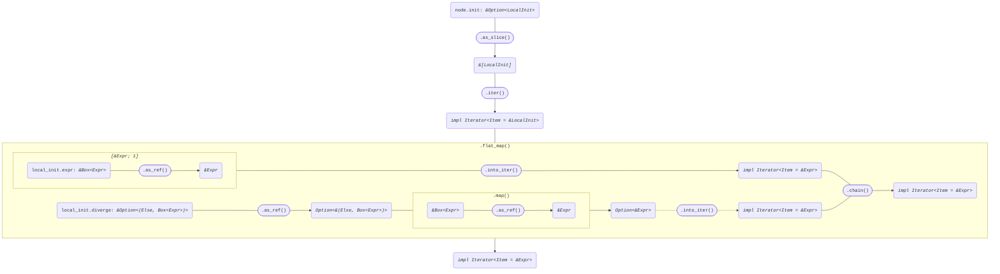
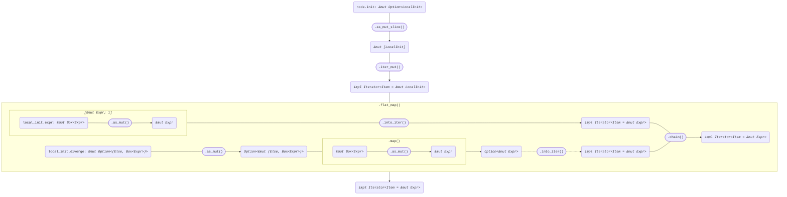

+++
title = "Struct Local"
+++

[docs.rs](https://docs.rs/syn/latest/syn/struct.Local.html)

```rust
pub struct Local {
    pub attrs: Vec<Attribute>,
    pub let_token: Let,
    pub pat: Pat,
    pub init: Option<LocalInit>,
    pub semi_token: Semi,
}

pub struct LocalInit {
    pub eq_token: Eq,
    pub expr: Box<Expr>,
    pub diverge: Option<(Else, Box<Expr>)>,
}
```

## Iterator<Item = &Expr>

node: *&Local*

```rust
node.init
    .as_slice()
    .iter()
    .flat_map(|local_init| {
        [local_init.expr.as_ref()]
            .into_iter()
            .chain(
                local_init
                    .diverge
                    .as_ref()
                    .map(|(_, expr)| expr.as_ref()),
            )
    })
```



## Iterator<Item = &mut Expr>

node: *&mut Local*

```rust
node.init
    .as_mut_slice()
    .iter_mut()
    .flat_map(|local_init| {
        [local_init.expr.as_mut()]
            .into_iter()
            .chain(
                local_init
                    .diverge
                    .as_mut()
                    .map(|(_, expr)| expr.as_mut()),
            )
    })
```


